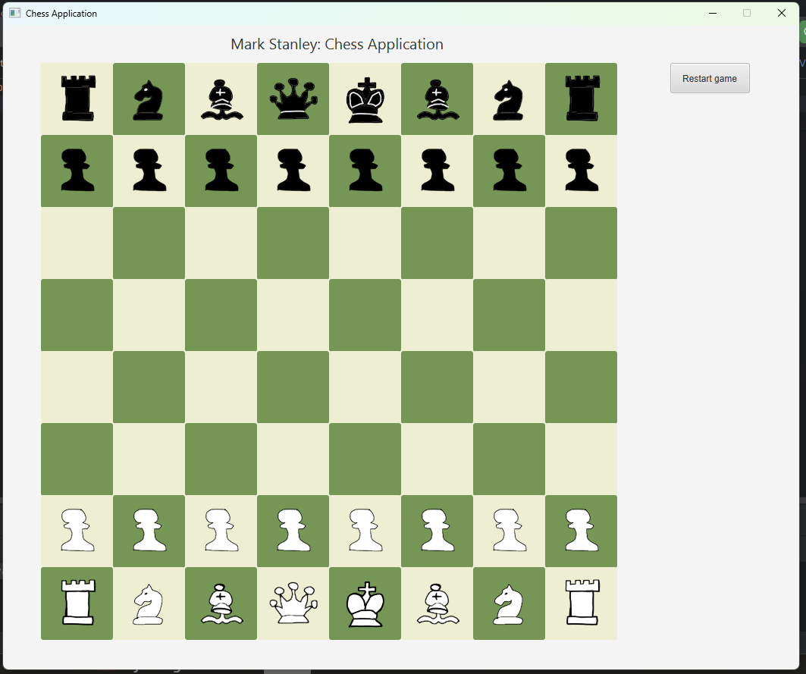
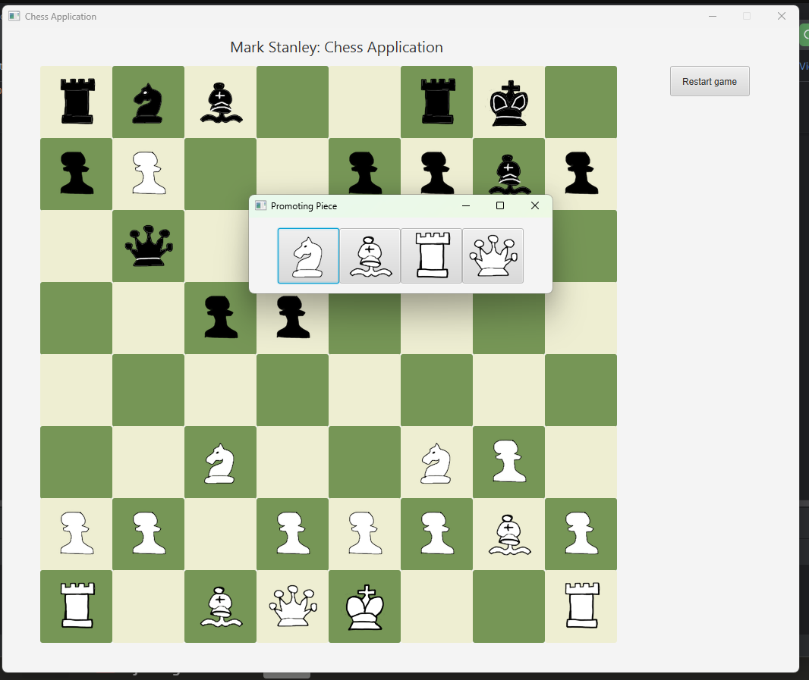

# Project: JavaFX Chess Application

## Description: A chess program that allows the user to play games of chess with themself.

I made this project outside of school after learning some javaFX in a course I took. I was interested in applying some of my skills into a project I was interested in. 
When development is complete, I will add a downloadable program available for anyone to try. 

To see the application currently, see the images or set up the project yourself (instructions below)

Features: The game includes most chess rules, including captures, en passant, and piece promotion. A restart game button was added for convenience. 
More could be added at a later date. 

# Chess Board:

# Promotion Window:

# Steps to set up the project:

- Clone the repository
- Open the project in intelliJ IDEA
- If you do not have JavaFX bundled with your JDK, you will need to download it and add it as a library to the project structure
- Configure JavaFX in run configurations: add the following link in the VM Options field in + > Application > VM options: --module-path PATH --add-modules javafx.controls,javafx.fxml (replacing PATH with the path to the lib directory in the JavaFX SDK folder.

- Launch the GameApplication file and view the project!  

# **Note: This project is currently in active development. New features and bug fixes are being worked on.**
